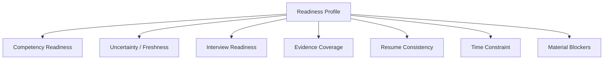
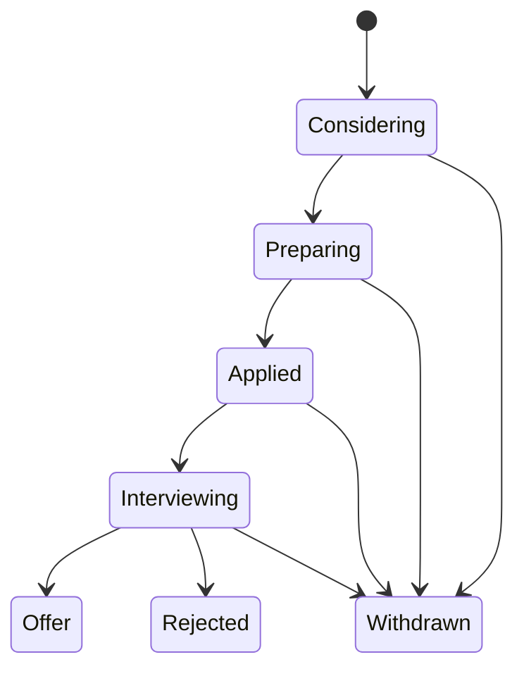
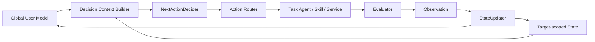
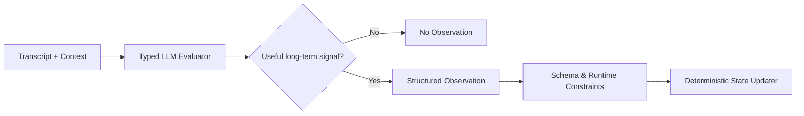
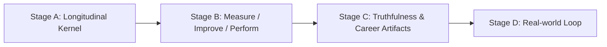

# 00. Master Specification

> 本文是整套设计的压缩版。需要具体实现细节时跳转到对应专题文档。

## 1. System Objective

系统最高层优化目标：

> **在时间约束下最大化用户对当前 Active Target Job 的多维 Readiness；没有 Active Target Job 时，则最大化 Active Career Target 的 Career Readiness。**

Readiness 不使用单一总分，而由以下维度构成：



系统允许 `READY / NO_ACTION`。没有关键 blocker 时，不为了“Agent 活跃”继续制造任务。

## 2. Domain Separation

以下状态必须分离：

| 状态 | 含义 | 典型问题 |
|---|---|---|
| Competency State | 用户会什么、掌握度和确定度 | “用户是否真正理解 MVCC？” |
| Evidence State | 用户做过什么、能证明什么 | “项目是否真的使用 Redis？” |
| Interview State | 面试条件下的表现 | “追问后是否仍能稳定表达？” |
| Preference State | 学习/反馈偏好 | “更适合问题驱动还是讲解驱动？” |
| Resume State | 对外表达的派生 Artifact | “这一版简历是否匹配当前岗位？” |
| Career Experience Memory | 用户真实求职历史 | “过去实际面试常暴露什么问题？” |

关键命题：

```text
Competency ≠ Evidence ≠ Interview Performance ≠ Resume Claim
```

学习提升 Competency，不自动产生项目 Evidence；面试结束不自动改 Resume；Resume 不是 source of truth。

## 3. Modes and Targets

- 可以保存多个 Career Target，但同一时刻只有一个 `activeCareerTarget`。
- 一个 Career Target 下可保存多个 Target Job，但同一时刻只有一个 `activeTargetJob`。
- 无 active Target Job：`Career Mode`。
- 有 active Target Job：`Target Job Mode`。
- Active Target Job 是当前优化主目标；Career Target 是长期约束与 tie-breaker。
- Agent 可以做 Goal Fit Analysis，但不能自行切换 Career Target / Target Job。

Target Job 生命周期：



`offer/rejected/withdrawn` 后自动解除 active，但不自动激活下一个 Job；系统只能推荐，用户确认后切换。

## 4. Core Loop



原则：**one decision → one action → state update → replan**。

不生成长期、必须机械执行的 multi-step plan。

## 5. Workflow vs Agent

### Workflow 负责

- task lifecycle；
- active/paused task；
- target scope；
- candidate action 过滤；
- prerequisite / policy validation；
- human boundary；
- persistence / recovery；
- state update / replan。

### LLM / Agent 负责

- 语义判断；
- 问题选择与追问；
- 教学策略；
- interview agenda；
- evidence/role/resume 语义分析；
- Next Action 在合法候选中的选择与解释。

外层不是 fully agent-driven；也不需要第三方 workflow framework。v1 使用轻量 custom workflow。

## 6. Task Agent Model

三个独立 Agent Definition，共享 Base Task Runtime：

```text
Base Task Runtime
├── AssessmentAgent — 测量 uncertainty / mastery
├── TutorAgent      — 提升 competency
└── InterviewAgent  — 模拟真实面试表现
```

- 同一时刻仅一个 active interactive task；
- task 不允许嵌套；
- user message 由 Session Router 直接路由给 active Task Agent；
- Task Agent 不能启动另一个 Task Agent；
- Task Agent 不能直接修改长期 User Model；
- Task Agent 与长期 Evaluator 分离。

### Measurement contamination

Assessment/Interview 中一旦用户请求教学/即时反馈并得到内容，原测量被污染：原 Task 结束/失效，不可教学后继续当作同一有效测量。

## 7. Evaluator / Observation / State



Evaluator 输出主要包含：

- `masterySignal` 或其他目标 signal；
- `evidenceStrength`；
- `confidence`；
- strengths / weaknesses / misconceptions；
- provenance / transcript refs。

不使用固定 `sourceWeight`。来源是 Evaluator 的语义输入，并可有 runtime cap；不是硬编码“Assessment=1.0, Interview=0.75”。

Raw Observation append-only；challenge/re-evaluation 使用 amendment/supersession，不静默覆盖历史。

Runtime Error 与 Domain Observation 完全分离。

## 8. v1 Competency Aggregation Default

为了让实现可直接开始，v1 采用可替换的确定性聚合器：

1. 过滤 `superseded`；`contested` 默认不进入主 estimate，但保留可见性；
2. `observationWeight = clamp(evidenceStrength × evaluatorConfidence, 0, 1)`，再应用 source-specific **cap**，不应用固定 source weight；
3. `mastery` = active competency observations 的 weighted mean；没有足够 evidence 时为 `unknown/null`，不伪造 0.5；
4. `baseConfidence` 由有效 evidence mass 与 observation consistency 计算；
5. `freshness` 单独由最后一次强 evidence 的时间计算；
6. `effectiveConfidence = baseConfidence × freshness`；
7. **mastery 不因时间自动下降，freshness/confidence 随时间下降**，从而满足 `stale ≠ weak`。

具体公式与默认参数见 `11-implementation-architecture.md`，并通过 Eval 调优。

## 9. Competency Graph

- 使用 DAG，不是 tree；
- canonical ID；
- node 分 `taxonomy` 与 `assessable`；
- taxonomy node 不拥有 UserCompetencyState；
- 子节点 mastery 不自动反写父节点；
- global UserCompetencyState 唯一，Target Job 只定义 requirement；
- JD mapping = explicit JD + canonical role model + current market evidence + low-authority LLM inference；
- canonical ontology 是 source of truth；RAG 只用于 retrieval/mapping；
- 未识别 competency 进入 proposal，不自动 promote。

## 10. Evidence / Resume

Evidence 只整理已有材料，不主动设计新项目制造 Evidence。

Evidence confidence：

```text
claimed → confirmed → supported
```

但 Evidence entity 的 `supported` 不代表所有 Claim 都被支持。Resume 使用 claim-level `ClaimSupport`：

```text
Evidence exists
     ↓
Claim-specific support evaluation
     ↓
unsupported / partial / supported
```

Resume：

```text
Profile + Evidence + Target
          ↓
Master Resume
          ↓
Target Resume
```

修改 Resume 的有效触发：new evidence、target change、claim mismatch/overclaim、明确用户请求。Learning 或一次 Interview 本身不是自动更新触发。

## 11. Memory / Persistence

```text
File Workspace = Source of Truth
Live Workflow / AgentSession = Recoverable Runtime
```

Memory 分层：

1. Working Memory：当前 AgentSession；
2. Structured Current State：YAML/frontmatter；
3. Semantic Memory：Markdown summary；
4. Episodic/Event Memory：append-only JSONL。

Task：immutable input、typed local state、JSONL transcript、structured result、runtime events；完成后全部保留用于 replay/eval。

ContextBuilder 采用：

```text
Current State + Long-term Summary + Recent Relevant Raw Events
```

而不是把完整 workspace 塞给模型。

## 12. Pi Strategy

- 主 runtime：TypeScript/Node；
- 使用 Pi SDK/Core 作为 AgentSession runtime；
- extension-first，不轻易修改 Pi Core；
- Agent Skill 使用 `SKILL.md` / Pi skills；
- 基础 read/write/edit/bash/search 直接复用 Pi 内置能力；
- 自定义 Tool 只用于 domain operation / invariant / lifecycle / structured query；
- Task Agent 使用独立 Pi AgentSession，v1 同一 Node process；
- 用 `PiRuntimeAdapter` 隔离上游 Pi API 和版本变化；
- exact Pi package/version 必须锁定在 lockfile 和 `pi-runtime-version.json` 中。

## 13. Security

- JD/Resume/README/Web/上传文档一律是 **untrusted data**，不能成为 system/policy instruction；
- least-privilege tool set；
- workspace path allowlist；
- local-first，默认不上传用户材料；
- credentials 不写入 workspace；
- evaluator / task input 做明确数据边界；
- third-party Pi extensions/packages 视为 executable code，必须审计并 pin。

## 14. User-visible Product State

三个一等视图：

1. **Readiness View**：当前 blocker、uncertainty、推荐 action、reason；
2. **Career Profile**：全局 competency/evidence/interview/preferences，用户可纠正事实、challenge 评价；
3. **Progress / Decision History**：material changes 与重要 decision provenance。

只有 material state change 主动通知，不把每个 observation 都暴露给用户。

## 15. Real-world Outcome

真实求职结果进入闭环，但：

```text
rejection / offer ≠ competency evidence
```

只有具体可归因反馈转为 Observation；outcome 本身作为 Career Outcome Event / Career Experience Memory。

## 16. Eval / Replay

Eval 是架构一等模块：

- Role/Competency mapping eval；
- ContextBuilder eval；
- NextAction eval；
- Assessment/Tutor/Interview behavior eval；
- Evaluator calibration eval；
- deterministic StateUpdater tests；
- Evidence/Resume fidelity eval；
- 12 条 Golden Career Journeys；
- crash/retry/security chaos tests。

Model/prompt upgrade 不能静默重写历史：shadow replay → compare → explicit migration。

## 17. Core Release Stages



Stage A：Bootstrap → Readiness → Next Action → Assessment → Observation → State → Replan。  
Stage B：加入 Tutor + Interview。  
Stage C：Evidence + claim provenance + Resume。  
Stage D：真实 outcome loop。

## 18. Non-goals

- multi-active Career Target / Target Job；
- automatic job application / JobOps；
- proactive evidence project generation；
- vector DB / graph DB 作为前置依赖；
- canonical ontology 自动自修改；
- single readiness percentage；
- always-on autonomous background agent；
- fully agent-driven outer orchestration；
- Task nesting；
- Task Agent 直接写 User Model；
- 重复封装 Pi 内置 read/write/search。
