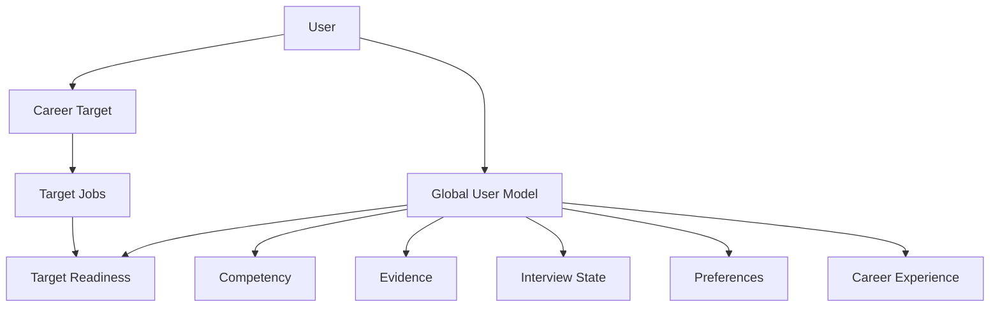

# 01. Product & Domain Specification

## 1. Product Positioning

产品不是“几个 AI 功能的集合”，而是一个长期 Career State Agent。核心价值在于：

- 能持续记住用户真实状态；
- 能区分“不会 / 不确定 / 会但表现不稳定”；
- 能围绕当前目标选择下一步，而非静态生成学习计划；
- 能把学习、面试、简历、真实求职结果放进同一个长期闭环；
- 能解释为什么状态变化、为什么推荐当前行动。

## 2. Primary Objects

## 3. Career Target vs Target Job

### Career Target

长期方向，例如：Backend Engineer、AI Agent Engineer。

- 多个可保存；
- 只有一个 active；
- 决定长期 role model 和长期 preparation context。

### Target Job

具体公司/岗位/JD。

- 属于某个 Career Target；
- 多个可保存；
- 只有一个 active；
- 带 JD、deadline、application/interview 状态；
- 决定当前短期 optimization context。

## 4. Career Mode / Target Job Mode

### Career Mode

没有 active Job 时仍然可：

- 做 Career Readiness；
- Assessment；
- Tutor；
- 通用 Mock Interview；
- Evidence/Resume review；
- 维护长期 competency freshness。

输入优先：canonical role model + current market evidence + global state。

### Target Job Mode

具体 Job 激活后：

- explicit JD authority 最高；
- current deadline/interview date 成为决策变量；
- Target Resume 进入 interview context；
- blockers 更聚焦具体 requirement。

## 5. Readiness Semantics

Readiness 是多维 profile，不是单分数。

建议用户可见维度：

| Dimension | 状态语义 |
|---|---|
| Competency | 关键能力是否达到岗位要求 |
| Uncertainty/Freshness | 画像是否足够可信、是否过时 |
| Interview | 技术准确、结构、清晰度、追问稳定性 |
| Evidence | 关键能力是否有真实经历支持 |
| Resume | Claim 是否真实、匹配、可解释 |
| Time | 剩余时间是否改变策略 |

状态标签以 `ready / needs_work / uncertain / stale / blocked` 为主，避免伪精确总分。

## 6. Goal Fit

系统可以指出：

- 当前目标与现有 competency/evidence 差距很大；
- 某岗位级别明显超出现状；
- 某另一个已保存目标可能更匹配。

但只能 recommend，不能自动切换目标。

## 7. User Authority

### 用户拥有最终纠正权的事实

- 项目日期；
- 工作经历；
- ownership；
- 使用过的技术；
- 面试是否发生；
- offer/rejection/withdrawn；
- 实际 outcome。

### 用户不能直接覆盖的评价

- mastery estimate；
- interview performance；
- inferred preference；
- readiness blocker。

用户可 challenge，系统记录 dispute，降低/暂停该 observation 的有效性，并建议 reassessment。

## 8. Preference Learning

Preference State 同时接受两类信号：

- explicit preference：用户明确要求的学习/反馈方式，高置信；
- behavior-inferred preference：例如反复跳过理论、持续要求代码/问题驱动，低置信并逐步累积。

Preference 影响 Tutor/feedback context，但不应覆盖用户当前显式指令。

## 9. Material Changes

只主动通知显著变化：

- primary blocker 改变；
- uncertain → clear strength/weakness；
- ready 状态改变；
- major Resume/Evidence mismatch；
- Goal Fit 显著变化；
- 真实 interview feedback 改变策略。

## 10. Product Non-goals

- 自动投递；
- 自动联系 recruiter；
- 创建“用于简历”的虚构项目；
- 多目标并行资源调度；
- 单一 readiness score；
- 无限 autonomous background loop。
