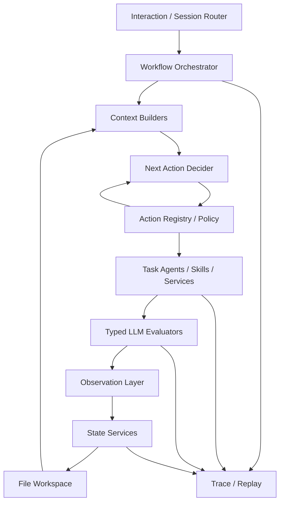
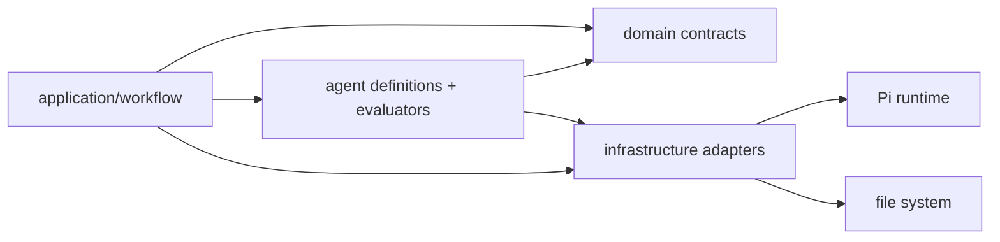
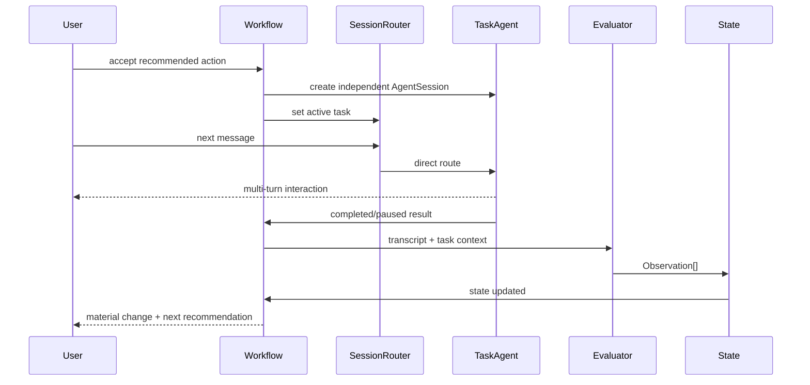

# 02. System Architecture

## 1. Architectural Style

采用 **hybrid orchestration**：

- 外层：轻量 custom deterministic workflow；
- 内层：具有多轮不确定性的 agentic task；
- 语义判断：typed LLM services；
- 长期状态更新：deterministic state services；
- 状态事实源：local file workspace。



## 2. Control Plane vs Data Plane

### Control Plane

- WorkflowRunner
- SessionManager
- ActionRegistry
- CandidateBuilder
- PolicyValidator
- NextActionDecider
- Human Boundary

### Data/State Plane

- User Model
- Target state
- Competency catalog
- Evidence store
- Observation log
- runtime event log
- task transcripts/results

分离的目的：LLM 不直接拥有系统 lifecycle 和 state authority。

## 3. Component Responsibilities

| Component | Responsibility | LLM? |
|---|---|---|
| WorkflowRunner | 当前 run 的步骤与生命周期 | No |
| CandidateBuilder | 基于硬前置过滤合法 Actions | No |
| NextActionDecider | 在合法候选中做语义选择与解释 | Yes |
| SessionRouter | user message → active task | No |
| ContextBuilder | 从 workspace 构建 curated context | Mostly No; semantic summary 可用 LLM |
| Task Agent | 多轮交互/探索 | Yes |
| Evaluator | 从完整交互提取长期信号 | Yes |
| StateUpdater | 应用 Observation、维护 invariant | No |
| Evidence/Role/Resume Analyzer | 一次性语义任务 | Yes, usually Skill/service |
| FileStore | atomic files / JSONL | No |
| TraceStore | runtime/LLM/provenance traces | No |

## 4. Dependency Direction



禁止：

- domain import Pi；
- StateUpdater import Agent；
- Agent 直接 import concrete filesystem path logic；
- evaluator 回调 workflow；
- task nesting。

## 5. One-active-task Invariant

同一 user/workspace 同一时刻：

```text
0 or 1 active interactive Task
0..N paused Tasks
```

自动内部 action 不计为 interactive Task。

## 6. Handoff



无需每个 user turn 都经过“主 Agent LLM”。

## 7. Failure Isolation

- Task crash → RuntimeEvent，Task 状态 failed/paused，不污染 User Model；
- Evaluator crash → 可重试，Task transcript 保留；
- State update crash → idempotent retry；
- corrupted summary → 可从 raw observations 重建；
- live AgentSession 丢失 → 从 task metadata + transcript/context snapshot 重建。
