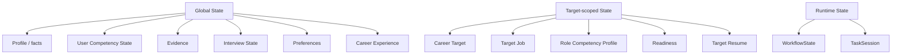

# 03. State & Data Model

## 1. State Ownership



不要复制 Global User Model 到每个 Job。

## 2. Core Type Shapes

```ts
type Id = string;
type ISODateTime = string;

type TaskStatus =
  | "active"
  | "paused"
  | "completed"
  | "cancelled"
  | "failed";

type TargetJobStatus =
  | "considering"
  | "preparing"
  | "applied"
  | "interviewing"
  | "offer"
  | "rejected"
  | "withdrawn";
```

## 3. Competency

```ts
interface CompetencyNode {
  id: string;                  // canonical: mysql.mvcc
  name: string;
  description: string;
  domain: string;
  kind: "taxonomy" | "assessable";
  parents: string[];
  prerequisites: string[];
  relatedCompetencies: string[];
  aliases: string[];
  tags: string[];
  version: number;
}

interface UserCompetencyState {
  competencyId: string;
  mastery: number | null;      // unknown => null
  baseConfidence: number;      // evidence quantity/consistency
  freshness: number;           // current relevance of estimate
  effectiveConfidence: number; // baseConfidence * freshness
  status: "unknown" | "estimated" | "stale";
  misconceptions: string[];
  observationCount: number;
  recentObservationIds: string[];
  lastStrongObservedAt?: ISODateTime;
  updatedAt: ISODateTime;
}
```

`taxonomy` node 没有 `UserCompetencyState`。

## 4. Career Target / Target Job

```ts
interface CareerTarget {
  id: Id;
  name: string;
  description?: string;
  status: "active" | "inactive" | "archived";
  createdAt: ISODateTime;
  updatedAt: ISODateTime;
}

interface TargetJob {
  id: Id;
  careerTargetId: Id;
  company?: string;
  title: string;
  jdSourceRef?: string;
  status: TargetJobStatus;
  applicationDate?: string;
  interviewDate?: string;
  deadline?: string;
  createdAt: ISODateTime;
  updatedAt: ISODateTime;
}

interface RoleCompetencyRequirement {
  competencyId: string;
  importance: number;
  requiredMastery?: number;
  authority: "explicit_jd" | "canonical" | "market" | "inferred";
  confidence: number;
  sourceRefs: string[];
}
```

## 5. Interview State

```ts
type InterviewDimension =
  | "technical_accuracy"
  | "clarity"
  | "structure"
  | "depth"
  | "follow_up_stability";

interface InterviewDimensionState {
  dimension: InterviewDimension;
  estimate: number | null;
  confidence: number;
  freshness: number;
  recentObservationIds: string[];
}
```

## 6. Evidence / Claim

```ts
type EvidenceConfidence = "claimed" | "confirmed" | "supported";

interface Evidence {
  id: Id;
  title: string;
  type: "project" | "work_experience" | "code" | "document" | "benchmark" | "other";
  description: string;
  confidence: EvidenceConfidence;
  competencyIds: string[];
  artifactRefs: string[];
  sourceRefs: string[];
  createdAt: ISODateTime;
  updatedAt: ISODateTime;
}

interface ResumeClaim {
  id: Id;
  resumeId: Id;
  text: string;
  competencyIds: string[];
}

interface ClaimSupport {
  id: Id;
  claimId: Id;
  evidenceId: Id;
  supportLevel: "unsupported" | "partial" | "supported";
  sourceRefs: string[];
  rationale: string;
}
```

## 7. Observation

```ts
interface ObservationBase {
  id: Id;
  timestamp: ISODateTime;
  source: ObservationSource;
  taskId?: Id;
  evaluationId?: Id;
  evidenceStrength: number; // evaluator semantic judgment
  confidence: number;       // confidence in this judgment
  evidenceRefs: string[];
  evaluator: {
    model: string;
    promptVersion: string;
    rubricVersion: string;
  };
}

interface CompetencyObservation extends ObservationBase {
  targetType: "competency";
  competencyId: string;
  masterySignal: number;
  findings: {
    strengths: string[];
    weaknesses: string[];
    misconceptions: string[];
  };
}

interface InterviewObservation extends ObservationBase {
  targetType: "interview_dimension";
  dimension: InterviewDimension;
  signal: number;
}
```

`ObservationSource` 包括 assessment / tutor / interview / self_report / resume / evidence / real_feedback 等，但 source 不直接等于固定权重。

## 8. Observation Amendment

```ts
interface ObservationAmendment {
  id: Id;
  observationId: Id;
  type: "contested" | "superseded" | "restored";
  replacementObservationId?: Id;
  reason: string;
  actor: "user" | "system" | "migration";
  timestamp: ISODateTime;
}
```

Raw observation immutable；逻辑有效性由 amendment 链表达。

## 9. TaskSession

```ts
type TaskSession =
  | AssessmentTaskSession
  | TutorTaskSession
  | InterviewTaskSession;

interface BaseTaskSession<TType, TInput, TState> {
  id: Id;
  type: TType;
  status: TaskStatus;
  input: TInput;                     // immutable
  localState: TState;
  contextBinding: {
    careerTargetId?: Id;
    targetJobId?: Id;
    targetResumeVersion?: string;
    contextSnapshotRef: string;
  };
  transcriptPath: string;
  resultPath?: string;
  createdAt: ISODateTime;
  updatedAt: ISODateTime;
}
```

## 10. Workflow State

```ts
interface WorkflowState {
  activeTaskId?: Id;
  pausedTaskIds: Id[];
  lastCompletedTaskId?: Id;
  pendingUserIntent?: UserIntent;
  activeCareerTargetId?: Id;
  activeTargetJobId?: Id;
  schemaVersion: number;
}
```

## 11. Runtime Event

```ts
interface RuntimeEvent {
  id: Id;
  timestamp: ISODateTime;
  level: "debug" | "info" | "warn" | "error";
  type: string;
  executionId?: Id;
  taskId?: Id;
  metadata: Record<string, unknown>;
}
```

RuntimeEvent 永不进入 User Model。
