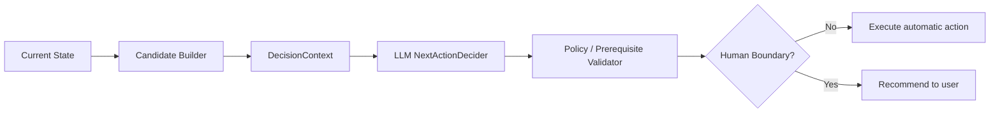

# 04. Readiness, Workflow & Decision Policy

## 1. Action Registry

v1 ActionType：

```ts
type ActionType =
  | "ANALYZE_ROLE"
  | "ASSESS"
  | "LEARN"
  | "REVIEW"
  | "MOCK_INTERVIEW"
  | "ANALYZE_EVIDENCE"
  | "UPDATE_RESUME"
  | "REFRESH_PROFILE"
  | "NO_ACTION";
```

`BUILD_EVIDENCE` 明确不存在。


## 2. Action Routing Semantics

| Action | Execution unit | Human boundary |
|---|---|---|
| ANALYZE_ROLE | Role Analysis Skill / typed service | normally automatic after user supplies target/JD |
| ASSESS | AssessmentAgent | confirm before starting |
| LEARN | TutorAgent | confirm before starting |
| REVIEW | TutorAgent with review-oriented input/policy | confirm before starting |
| MOCK_INTERVIEW | InterviewAgent | confirm before starting |
| ANALYZE_EVIDENCE | Evidence Analysis Skill / typed service | automatic analysis is allowed; factual promotion may require user clarification |
| UPDATE_RESUME | Resume Skill/service | mutation requires user confirmation |
| REFRESH_PROFILE | deterministic/LLM compaction service | automatic |
| NO_ACTION | no execution | report readiness / stop run |

`REVIEW` 不创建第四个 interactive Agent；它复用 TutorAgent 的 runtime，只改变 learning objective。

## 3. Decision Pipeline



### CandidateBuilder 只做硬约束

示例：

- 无 active Target/Career context → 某些 action 非法；
- 已有 active interactive task → 新 interactive task 非法；
- 当前 task resume eligibility 失败 → 不能继续旧 task；
- action schema / required target 缺失 → 非法。

不要把“confidence<0.4 就 assess”写成硬业务规则。

## 4. DecisionContext

```ts
interface DecisionContext {
  mode: "career" | "target_job";
  target: TargetSummary;
  readiness: ReadinessProfile;
  topCompetencyGaps: CompetencyGapSummary[];
  uncertainties: UncertaintySummary[];
  interview: InterviewSummary;
  evidence: EvidenceCoverageSummary;
  resume: ResumeConsistencySummary;
  timeConstraint?: TimeConstraintSummary;
  recentMaterialChanges: MaterialChangeSummary[];
  recentActions: RecentActionSummary[];
  userIntent?: UserIntent;
  candidates: ActionCandidate[];
}
```

ContextBuilder 不给模型整个 workspace。

## 5. NextAction Output

```ts
interface NextActionDecision {
  action: ActionType;
  target?: {
    competencyIds?: string[];
    targetJobId?: string;
  };
  reason: string;
  expectedOutcome: string;
  priority: "high" | "medium" | "low";
  alternative?: {
    action: ActionType;
    reason: string;
  };
}
```

用户可见 explainability 至少回答：

- 为什么现在；
- 为什么这个 action；
- 主要依据是什么；
- 为什么不是另一个明显 action。

## 6. User Intent Priority

```text
Runtime/Policy Constraint
        >
Explicit User Intent
        >
Workflow Recommendation
```

用户说“直接面试”时不强制先走系统推荐，但仍需通过 prerequisites。

## 7. Time-aware Decision

同样 blocker，不同时间应产生不同策略：

- 2 天：优先 interview rehearsal / critical blockers / resume consistency；
- 2 个月：允许系统学习、广泛 assessment、长期 review。

时间是 DecisionContext 一等字段，不是 profile 备注。

## 8. Readiness Blocker Construction

Readiness View 可以由 deterministic summaries + LLM semantic synthesis 共同构造：

- deterministic：requirement gap、freshness、evidence support、task history；
- LLM：哪些是“material blockers”、如何解释冲突、优先级语义。

典型 blocker：

```text
HIGH_IMPORTANCE + LOW_EFFECTIVE_CONFIDENCE → uncertainty blocker
HIGH_IMPORTANCE + CONFIRMED_LOW_MASTERY    → competency blocker
KNOWLEDGE_STRONG + INTERVIEW_WEAK          → interview blocker
STRONG_RESUME_CLAIM + WEAK_SUPPORT         → resume/evidence blocker
```

这些是解释 rubric，不应实现成唯一硬阈值决策树。

## 9. READY / NO_ACTION

满足 blocker-based readiness 时允许 `NO_ACTION`：

- 无关键 competency blocker；
- 无关键 requirement 高 uncertainty/stale；
- 无严重 interview blocker；
- 无 material resume/evidence inconsistency。

仍可有低优先级提升项，但不能伪装成必须行动。

## 10. Loop Guard

防止：ASSESS X → ASSESS X → ASSESS X。

Runtime 记录：

```ts
interface RecentActionRecord {
  action: ActionType;
  targetKey: string;
  status: "completed" | "cancelled" | "failed";
  producedUsefulObservation: boolean;
  materiallyChangedState: boolean;
  timestamp: string;
}
```

同 action/target 连续无有效新信息时，CandidateBuilder 暂时 suppress，并向 DecisionContext 暴露原因。

## 11. Workflow Run Boundary

一次 `run()` 在以下情况结束：

- 需要用户输入/确认；
- interactive Task 完成并准备推荐下一项；
- 用户退出；
- 不可恢复错误；
- `NO_ACTION`。

系统不是无限后台 loop。
