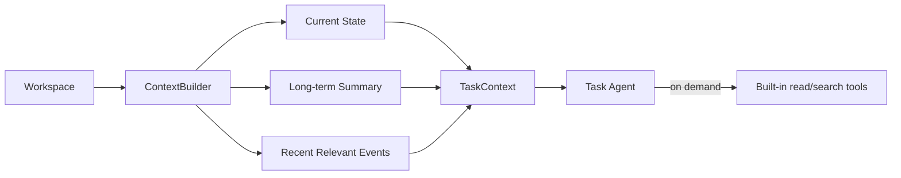

# 06. Memory, Context & Persistence

## 1. Memory Layers

```text
L1 Working Memory
   current Pi AgentSession / messages

L2 Structured Current State
   YAML / frontmatter

L3 Semantic Long-term Memory
   Markdown summaries

L4 Episodic / Audit Memory
   append-only JSONL observations/events/transcripts
```

## 2. Source of Truth

```text
File Workspace = durable source of truth
Live WorkflowRunner / AgentSession = cacheable, recoverable runtime
```

进程重启后不要求恢复 JS object identity，而是从文件重建。

## 3. Workspace Layout

```text
workspace/users/<user>/
├── meta.yaml
├── profile.md
├── goals/
│   ├── career-targets/*.md
│   └── active.yaml
├── jobs/
│   └── <job-id>/
│       ├── source.md
│       ├── job.yaml
│       ├── role-profile.yaml
│       ├── readiness.md
│       └── decision-history.jsonl
├── competencies/
│   └── <domain>.md
├── evidence/
│   ├── index.yaml
│   └── <evidence-id>.md
├── interview/
│   ├── profile.md
│   └── sessions/
├── preferences/
│   └── learning.md
├── resumes/
│   ├── master.md
│   └── targets/<job-id>.md
├── observations/
│   ├── raw/YYYY-MM.jsonl
│   ├── amendments.jsonl
│   ├── summaries/
│   └── index.json
├── outcomes/
│   └── events.jsonl
├── tasks/
│   └── <task-id>/
│       ├── task.yaml
│       ├── context-snapshot.json
│       ├── transcript.jsonl
│       ├── result.json
│       └── events.jsonl
├── runtime/
│   ├── workflow.yaml
│   └── bootstrap.json
└── traces/
    └── YYYY-MM/*.jsonl
```

## 4. Context Builder

Agent 不默认自行扫描整个 workspace。Workflow 在创建 task 前构建 curated `TaskContext`。



Agent 仍可用受限 built-in read/search 按需深入，但不重新造 `read_competency()` 等工具。

## 5. Context Rules

- 默认只注入目标相关 competency；
- Interview 注入 Target Resume snapshot，不注入所有历史 resume；
- raw observations 只取 recent/relevant；
- long-term summary 提供稳定 pattern；
- current exact state 优先于旧 summary；
- external content 明确标注 untrusted data；
- context snapshot 保存，用于 replay。

## 6. Observation Growth & Compaction

Raw log 永久保留；不通过删除解决 context growth。

v1 compaction default：满足任一条件触发某 target 的 semantic compaction：

- 自上次 summary 后新增 >= 30 条相关 observations；
- summary >= 30 天未刷新且存在新 observations；
- 出现 strong conflict / material change；
- 手动 maintenance。

参数放配置，不写死 domain code。

Summary 内容：stable strengths、repeated weaknesses、misconceptions、trend、important observation refs。Semantic compaction 可以使用 LLM；它只生成可重建的语义摘要，不负责数值 state update。数值聚合仍由 deterministic StateUpdater 完成。

## 7. Index

v1 不用数据库。Observation query 优先：

- 月度 raw JSONL；
- `index.json` 记录 competencyId → file/offset/id；
- 需要时用 built-in grep/find；
- 后续只有性能数据证明必要时再换存储实现。

## 8. Atomicity

Structured state 文件写入：

```text
write temp file → fsync/close → atomic rename
```

Append log：单 writer v1，line-delimited JSON，每条包含 unique id/execution id。

## 9. Freshness vs Mastery

时间不会自动把 mastery 从 0.9 改成 0.4；而是：

```text
mastery remains historical estimate
freshness ↓
effectiveConfidence ↓
status → stale
```

NextAction 对 stale 倾向重新验证，而不是默认 LEARN。

## 10. Git

Git 可用于开发/用户可选历史与 rollback，但不是 runtime transaction layer，也不是必须依赖。
