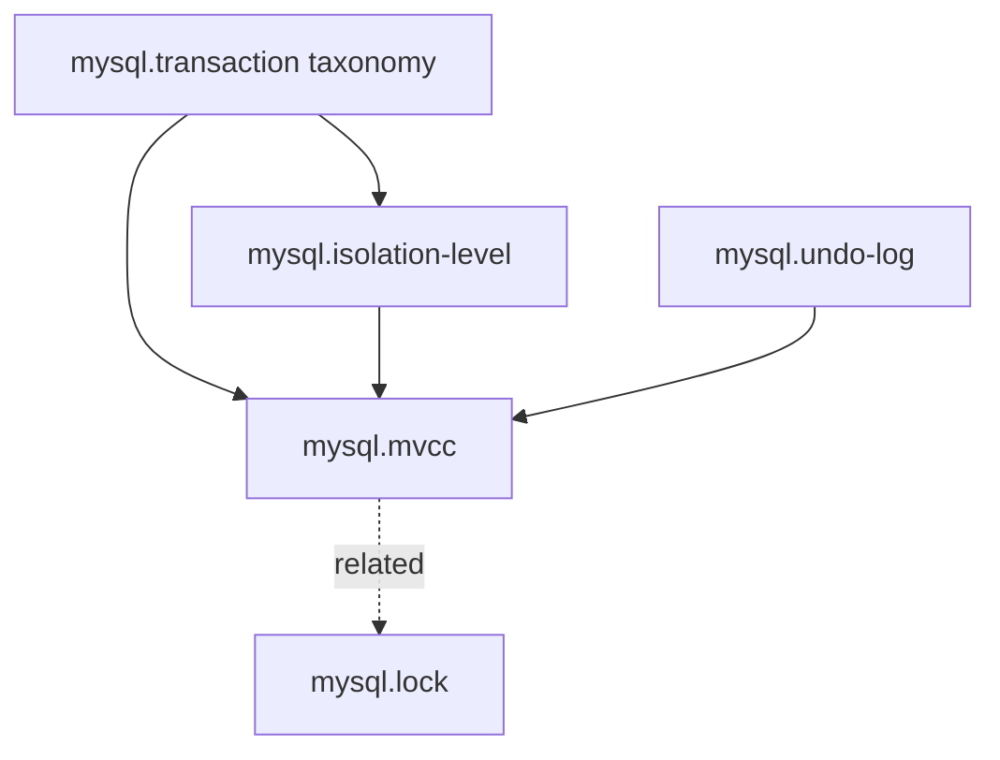
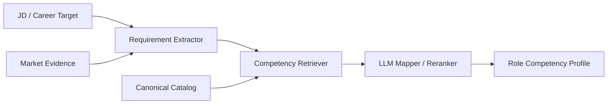

# 07. Competency, Role Model & Retrieval

## 1. Naming

Agent 开发能力：`Skill` / `SKILL.md`。  
用户职业能力：`Competency`。

## 2. Competency Graph

DAG，支持多父节点、prerequisite、related edges。



## 3. Canonical Files

```text
competency-catalog/
├── backend/
│   ├── mysql/mvcc.md
│   ├── mysql/isolation-level.md
│   └── redis/cache-consistency.md
└── ai-agent/
    ├── tool-calling.md
    └── evaluation.md
```

Frontmatter = graph/machine metadata；Markdown body = semantic definition、scope、examples、common interview topics。

## 4. Global State vs Role Requirement

```text
UserCompetencyState = global
RoleCompetencyRequirement = target-specific
```

同一个 `mysql.mvcc` 不为每个 JD 复制 mastery。

## 5. Role Analysis Authority

优先级：

```text
1. Explicit JD requirement      — highest
2. Canonical role expectation   — supplement
3. Current market evidence      — contemporary supplement
4. LLM inferred expectation     — hypothesis / lower authority
5. Personal career experience   — user-specific, never global truth
```

冲突时不能用 market average 覆盖 concrete JD。

## 6. JD → Competency Pipeline



## 7. Retrieval v1

不需要 Vector DB。

推荐：

- metadata exact/alias match；
- token/BM25-style lexical retrieval；
- domain/tag filters；
- LLM rerank/map top-K candidates。

实现暴露统一接口：

```ts
interface CompetencyRetriever {
  retrieve(query: string, opts: { topK: number; domains?: string[] }): Promise<CompetencyCandidate[]>;
}
```

v1 可使用 in-memory lexical index；将来替换 embedding retriever 不影响上层 contract。

## 8. Unknown Competency Governance

Retrieval 无合适 canonical node 时：

```text
UNKNOWN
→ create proposal
→ competencies/proposals/*.md
→ manual/maintainer review
→ promote in catalog release
```

v1 **不允许 LLM 自动修改 canonical ontology**。

## 9. Granularity

Assessable competency 应足够具体以支持 measurement 和 learning，例如 `mysql.mvcc`，而不是只有 `MySQL`；但不要无限细到每个 trivia 都是 node。

判断标准：是否能独立定义 learning objective、assessment evidence 和 role requirement。

## 10. Parent Aggregation

Taxonomy/grouping node 不保存 mastery。Broad readiness 在 query/view 时根据 relevant assessable children 动态综合，不反写 parent state。
