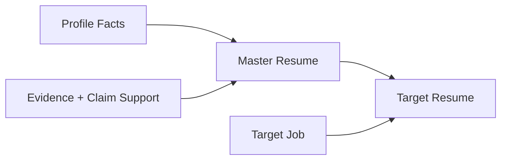
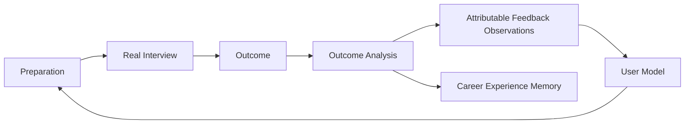

# 08. Evidence, Resume & Real-world Outcome

## 1. Evidence Boundary

系统只分析和整理用户已经存在的经历/材料：

- Resume；
- self-report；
- README；
- source code；
- docs；
- benchmark/result；
- work/project artifacts。

不主动创建新的 evidence project，不替用户制造经历。

## 2. Evidence Confidence

```text
claimed    — resume / self-report
confirmed  — user explicitly confirms factual existence
supported  — artifact/document/code materially supports it
```

LLM Evaluator 做语义判断；程序不使用“有 README 就 supported”这种写死规则。

## 3. Claim-level Support

Evidence entity 和 Resume Claim support 分离。

示例：README 能证明使用 Redis，但不能自动证明：

- “延迟降低 40%”；
- “本人主导架构”；
- “支撑百万 QPS”。

每个重要 Resume Claim 必须有 `ClaimSupport`。

## 4. Bootstrap Semantics

Resume ingestion 同时产生两类候选：

```text
Resume competency claim → weak Competency Observation
Resume project/work statement → Evidence Candidate (claimed)
```

用户主动补充“我会 Kafka”同样是 weak self-report observation；用户补充“我在项目里用了 Kafka”可创建 claimed Evidence Candidate。两者都不会直接获得高 confidence。

首次导入 Resume 只建立 baseline Master Resume snapshot，不在 Bootstrap 阶段擅自优化/强化措辞。

## 5. Resume Model



- original uploaded resume 是 source artifact；
- Master Resume 是完整、真实、可维护的经历表达；
- Target Resume 是针对 Job 的选择/改写；
- Evidence/Profile 才是更底层事实源。

## 6. Resume Update Triggers

允许推荐/执行更新：

- new supported/confirmed evidence；
- target job change；
- interview/evaluator 暴露 claim mismatch；
- resume overclaim/underclaim；
- user explicit request。

不自动触发：

- 仅仅学会新知识；
- 每次 mock interview 结束；
- mastery score 上升。

## 7. Resume Editing Safety

Resume Skill 可以：选择、排序、压缩、重写措辞、调整匹配度。  
不能：添加不存在的技术、ownership、指标、项目、职责。

如果某强 claim support 不足：降低措辞强度、标记需用户确认，或建议移除。

## 8. Interview Cross-check

InterviewAgent 可以基于 Target Resume 深挖：

- 为什么这么设计；
- 具体 ownership；
- metric 如何测；
- failure modes；
- alternative choices。

InterviewEvaluator 可产生 claim consistency finding，但不会直接修改 Resume。

## 9. Real-world Outcome

真实事件：application、interview、offer、rejection、withdrawn。



原则：

```text
rejected / offer by itself
≠ competency evidence
```

只有可归因反馈，例如“无法解释缓存一致性”，才影响对应 competency/interview state。

## 10. Career Experience Memory

用户自己的真实求职 pattern 可以长期保留并参与未来 context，但不能因为 3 次面试就变成“全球 Backend 面试事实”。
