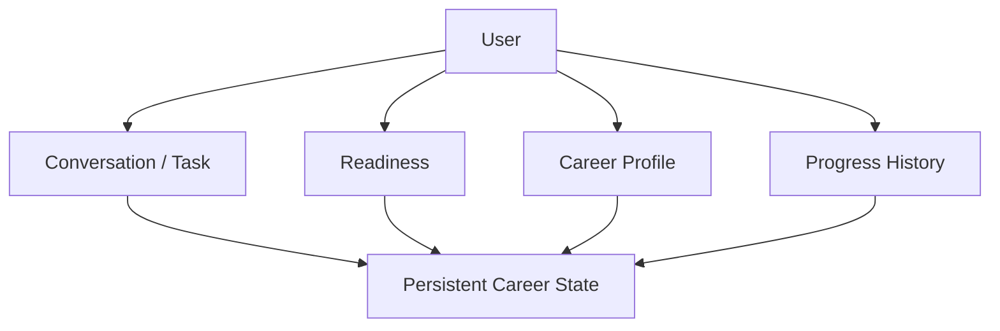

# 09. Product Experience & Human-in-the-loop

## 1. Primary Views

### A. Readiness View

回答：**“我距离当前目标还差什么，现在最值得做什么？”**

展示：

- active Career Target / Target Job；
- time constraint；
- primary blockers；
- uncertainty/stale items；
- interview/evidence/resume status；
- recommended Next Action + reason；
- 一个合理 alternative。

### B. Career Profile

回答：**“系统现在认为我是什么状态？”**

包含 global competency、evidence、interview、preferences、career experience。

允许：

- fact correction；
- evaluative state challenge；
- request reassessment。

### C. Progress / Decision History

回答：**“为什么系统现在这样判断？”**

只展示 material state changes 和关键 decisions，不是 raw JSONL dump。

## 2. Conversation as Execution Surface

产品不是 `Chat + hidden memory`。



Conversation 用来执行 Assessment/Tutor/Interview 和自然语言控制；State Views 是长期稳定界面。

## 3. Action Confirmation

默认：

- internal refresh/compaction/recompute：automatic；
- Assessment/Tutor/Interview：recommend → user confirm；
- Resume mutation：user confirm；
- target switch：user confirm；
- factual correction：user explicitly commits。

## 4. Task Switching

用户可 `/pause`, `/exit`, 或自然语言中断。v1 只需：active/paused/completed，无巨大 FSM。

切换到另一个 interactive task：

```text
pause/complete current
→ workflow
→ create new task
```

不嵌套。

## 5. Assessment UX

- 不实时显示正确答案；
- 可澄清题意；
- 请求教学时明确告诉用户本次测量将结束，随后可进入 Tutor；
- 结束后统一反馈。

## 6. Interview UX

- interview persona 持续；
- 不边问边 coach；
- 请求 feedback 时结束/暂停 interview；
- feedback 与 long-term state update 分开展示。

## 7. Material Change Message

模板语义：

```text
What changed
Why we believe it
What evidence caused it
How it changes your next action
How to challenge/correct if needed
```

不要只说“你的分数从 72 变成 65”。
