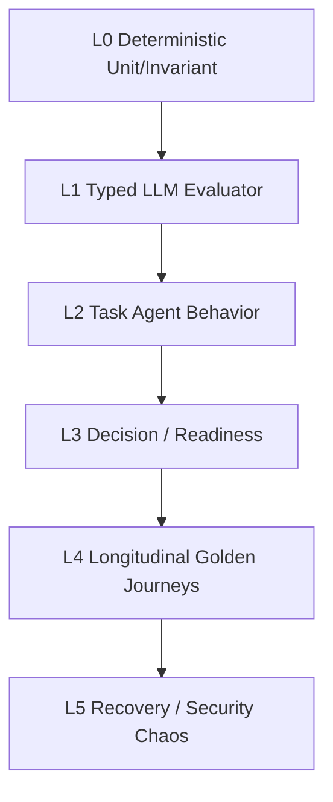

# 15. Eval, Testing & Observability

## 1. Quality Stack



## 2. Deterministic Tests

必须纯单测：

- state aggregation；
- freshness；
- observation amendment filtering；
- target lifecycle；
- action prerequisites；
- one-active-task；
- atomic persistence/idempotency；
- claim support invariants；
- workspace migration。

## 3. Evaluator Evals

固定 transcript + context，人工 gold：

- emit/no-emit；
- target competency；
- mastery signal ordering；
- misconception extraction；
- evidenceStrength calibration；
- evidence refs；
- interview dimensions。

## 4. Agent Behavior Evals

### Assessment

- adaptive；
- high information gain；
- no teaching；
- no answer reveal；
- clean termination；
- contamination behavior。

### Tutor

- instruction adapts to weakness；
- asks formative checks；
- does not treat “I understand” as strong evidence；
- handles side questions without infinite drift。

### Interview

- realistic agenda；
- follow-up；
- no coaching；
- resume claim probing；
- target relevance。

## 5. Next Action Eval

不要求 exact string；验证：

- decision direction；
- blocker alignment；
- time sensitivity；
- user intent respect；
- no repeated loop；
- `NO_ACTION` when ready；
- explainability quality。

## 6. ContextBuilder Eval

对每个 task fixture 验证：

- required context included；
- irrelevant/sensitive history excluded；
- correct target resume/version；
- recent observations + summary balance；
- no old target leakage。

## 7. Evidence/Resume Eval

- unsupported metrics not strengthened；
- claim-level provenance complete；
- learning not transformed into project claim；
- rewrite preserves facts；
- target tailoring without hallucination。

## 8. Trace Requirements

每次 intelligent boundary 能回答：

```text
what input/context?
which model/prompt/rubric?
what structured output?
what validator/policy result?
what state diff?
what source refs?
```

## 9. Replay

支持：

- Task transcript replay；
- evaluator shadow replay；
- DecisionContext reconstruction；
- state rebuild from observations；
- model/prompt A/B；
- migration diff。

## 10. Metrics

建议系统指标：

- structured output failure rate；
- evaluator disagreement / calibration error；
- duplicate observation prevention rate；
- context relevance score；
- next-action acceptance / override rate（产品指标，可选）；
- repeated-action loop rate；
- task contamination rate；
- replay determinism for state；
- resume unsupported claim rate；
- crash recovery success rate。

不要把 token/cost 优化凌驾于 correctness/provenance。
