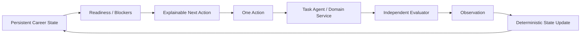

# Career Agent — Final Canonical Specification

> **文档状态：Final Architecture & Implementation Baseline**  
> 本目录是项目后续产品评审、架构评审、开发、测试、Eval 和开源说明的唯一 canonical 文档集。此前的增量设计文档均由本目录取代。

## 1. 一句话定义

Career Agent 是一个 **local-first、长期状态化、可解释、可恢复、可回放** 的 Career Agent System：围绕用户的 Career Target / Target Job 持续维护 Career State，以多维 Readiness 与 Blocker 为决策抽象，每次选择一个最有价值的 Action，通过专职 Assessment / Tutor / Interview Agent 获取新信号，再由独立 Evaluator 形成 Observation，并由确定性状态层更新长期画像后重新规划。

## 2. 文档阅读顺序

| 文档 | 用途 | 主要读者 |
|---|---|---|
| `00-master-spec.md` | 全系统压缩版，所有重要决策的总入口 | 所有人 |
| `01-product-domain-spec.md` | 产品目标、领域边界、运行模式、状态视图 | PM / Architect |
| `02-system-architecture.md` | 总体组件、控制面、数据面、依赖边界 | Architect / Engineer |
| `03-state-data-model.md` | Domain Model、状态所有权、核心数据契约 | Architect / Engineer |
| `04-readiness-workflow-decision.md` | Readiness、Blocker、Next Action、Workflow | PM / Architect / Engineer |
| `05-task-agents-evaluators.md` | Assessment/Tutor/Interview 与 Evaluator 协议 | Agent Engineer |
| `06-memory-context-persistence.md` | Memory、ContextBuilder、文件存储、恢复 | Agent/Platform Engineer |
| `07-competency-role-retrieval.md` | Competency Graph、JD/Role Mapping、RAG | Agent Engineer |
| `08-evidence-resume-outcome.md` | Evidence、Resume、真实求职 Outcome | PM / Agent Engineer |
| `09-product-experience.md` | 用户可见状态、HITL、交互与 material changes | PM / Frontend/Agent Engineer |
| `10-pi-runtime-tooling.md` | Pi 选型、Extension/Skill/Tool、权限边界 | Agent/Platform Engineer |
| `11-implementation-architecture.md` | Repo、模块依赖、技术栈、实现顺序 | Tech Lead / Engineer |
| `12-contracts-events-file-layout.md` | TS contracts、事件、文件布局、幂等约定 | Engineer |
| `13-prompt-model-governance.md` | Prompt、Model、结构化输出、版本治理 | Agent Engineer |
| `14-security-trust-privacy.md` | Prompt injection、权限、PII、local-first 安全 | Security / Engineer |
| `15-eval-testing-observability.md` | Eval、Replay、Tracing、测试策略 | Agent Engineer / QA |
| `16-golden-journeys-acceptance.md` | 12 条端到端 Golden Journey 与 Release Gate | PM / QA / Engineer |
| `17-operations-recovery-migrations.md` | Crash recovery、migration、compaction、runbook | Platform Engineer |
| `18-roadmap-scope-release.md` | Core/Important/Deferred、发布阶段、MVP | PM / Tech Lead |
| `19-adr-invariants.md` | Accepted/Rejected ADR、架构不变量 | Architect |
| `20-sources.md` | Pi 等外部技术依据与版本锁定原则 | Engineer / Reviewer |

## 3. Canonical 规则

1. **本目录内容优先于此前所有对话中的临时方案。**
2. `Skill` 只表示 Agent Skill / `SKILL.md`；用户能力统一称 `Competency`。
3. 文档中标注 `v1 default` 的参数是实现默认值，可经 Eval 调优；它们不是不可变产品语义。
4. 文档中的 Architecture Invariants 是最稳定的约束，任何新增功能都必须通过这些约束。
5. 如果上游 Pi API 发生变化，保持本系统的 runtime adapter contract，不让 Pi 的 API 变化泄漏到 domain/workflow 层。

## 4. 最核心的 8 个开源展示点

1. Hybrid Workflow + Agentic Tasks
2. Longitudinal User Model
3. Observation-based State Evolution
4. Independent Evaluators
5. Curated Context Engineering
6. Multi-Agent Handoff / HITL
7. Evidence / Claim Provenance
8. Replay / Eval / Golden Journeys

这 8 个点优先级高于外围功能数量。
